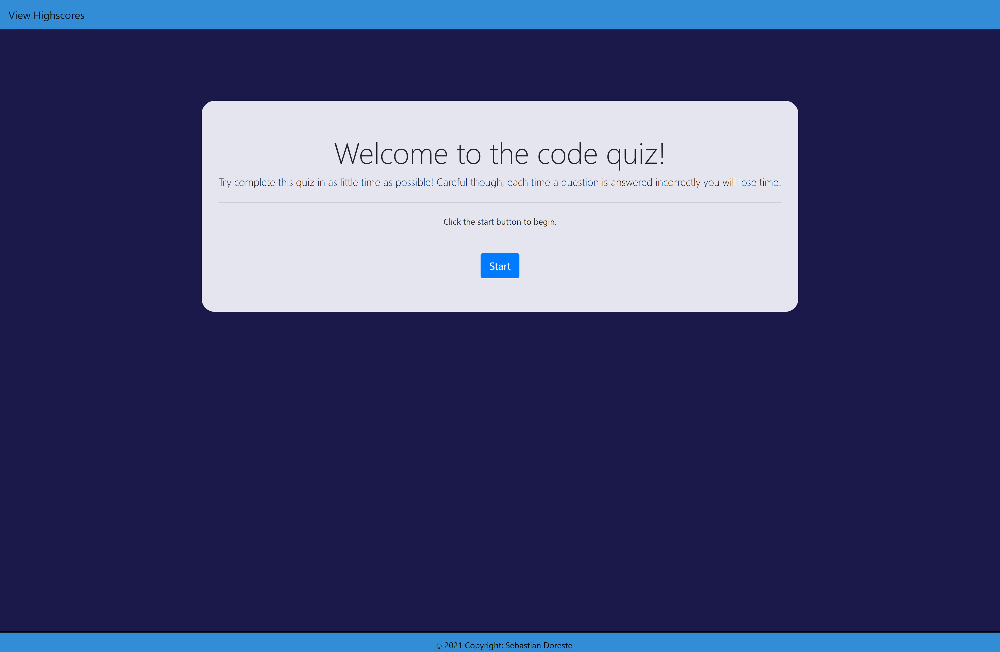

# Code-Quiz

## Description

This is a coding quiz to test your knowledge of JavaScript!

You have 50 seconds to answer 5 questions.

Each time you answer incorrectly you will lose 5 seconds off the clock.

Your score will be equal to the amount of time you have on the timer at the end of the quiz.

Good Luck and try and get on the leaderboard!

<!-- screenshot of website here -->

link to github pages: https://japexican.github.io/code-quiz/

Main Page

Quiz Page

Save Score Page

Highscores Page

